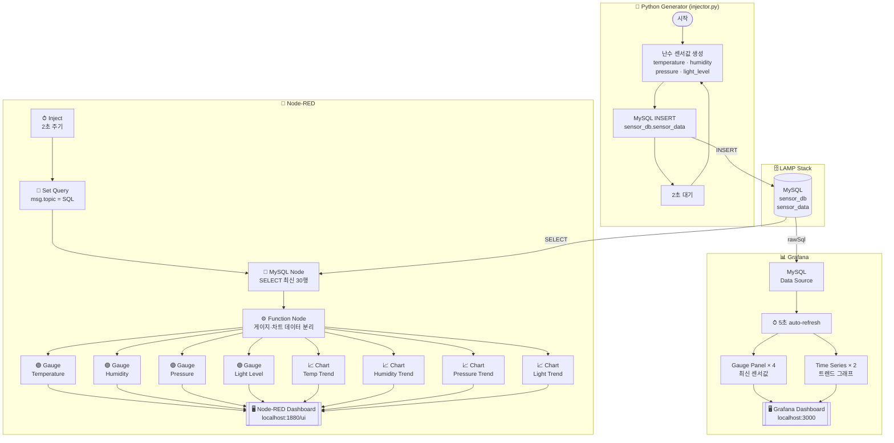
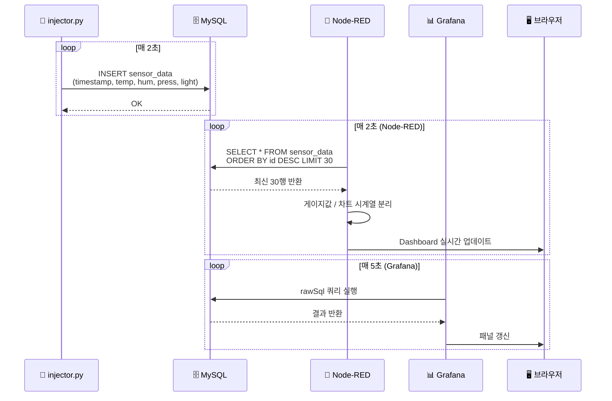

# 🌡️ Sensor Real-Time Monitoring System

> **MySQL + Node-RED + Grafana** 기반 IoT 센서 데이터 실시간 모니터링 플랫폼

---

## 📌 프로젝트 개요

`injector.py`가 난수 기반 센서 데이터를 **2초마다** 생성하여 LAMP 스택의 MySQL에 저장하고,
**Node-RED Dashboard**와 **Grafana Dashboard** 두 경로로 실시간 시각화합니다.

---

## 🧩 시스템 구성

| 구성 요소 | 버전 | 역할 |
|-----------|------|------|
| 🐍 Python | 3.12 | 난수 센서 데이터 생성 및 MySQL INSERT |
| 🗄️ MySQL | 8.0 | 센서 데이터 영속 저장 (`sensor_db`) |
| 🔴 Node-RED | 4.1.8 | MySQL 폴링 → UI 게이지 + 차트 |
| 📊 Grafana | latest | MySQL 데이터소스 → 실시간 대시보드 |

---

## 📂 파일 구조

```
project3/
├── 📄 injector.py                        ← 난수 데이터 생성 + MySQL INSERT
├── 📄 setup_db.sql                       ← DB / 테이블 / 사용자 초기화
├── 📄 setup.sh                           ← 원클릭 환경 설정 스크립트
├── 📄 requirements.txt                   ← Python 패키지 목록
├── 📄 node_red_flow.json                 ← Node-RED 플로우 (Import용)
└── 📁 grafana/
    └── 📁 provisioning/
        ├── 📁 datasources/
        │   └── 📄 mysql.yaml             ← Grafana MySQL 데이터소스
        └── 📁 dashboards/
            ├── 📄 dashboard.yaml         ← 대시보드 프로바이더 설정
            └── 📄 sensor_dashboard.json  ← Grafana 대시보드 정의
```

---

## 🌡️ 센서 데이터 항목

| 필드 | 단위 | 범위 | 설명 |
|------|------|------|------|
| `temperature` | °C | 15.0 ~ 40.0 | 온도 |
| `humidity` | % | 20.0 ~ 90.0 | 습도 |
| `pressure` | hPa | 980.0 ~ 1025.0 | 기압 |
| `light_level` | lux | 0.0 ~ 1000.0 | 조도 |

---

## 🔌 접속 정보

| 서비스 | URL | 계정 |
|--------|-----|------|
| Node-RED Editor | http://localhost:1880 | - |
| Node-RED Dashboard | http://localhost:1880/ui | - |
| Grafana | http://localhost:3000 | admin / admin |
| MySQL | localhost:3306 | monitor_user / monitor1234 |

---

## 🚀 실행 방법

### 1️⃣ DB 초기화
```bash
mysql -u root -p < setup_db.sql
```

### 2️⃣ 데이터 주입 시작
```bash
python3 -u injector.py
```
출력 예시:
```
=== Sensor Data Injector ===
Target DB : sensor_db@localhost
Interval  : 2s  (Ctrl+C to stop)

[OK] Connected to MySQL

[    1] 2026-03-26 15:00:20 | temp=33.57°C  hum=48.61%  press= 984.41hPa  light= 209.87lux
[    2] 2026-03-26 15:00:22 | temp= 31.1°C  hum=33.16%  press= 982.31hPa  light= 646.02lux
```

### 3️⃣ Node-RED 실행
```bash
# 설치 (최초 1회)
npm install -g node-red node-red-dashboard node-red-node-mysql

# 실행
node-red
```
> 브라우저 → http://localhost:1880 → 메뉴(≡) → Import → `node_red_flow.json` → **Deploy**

### 4️⃣ Grafana 실행
```bash
sudo cp -r grafana/provisioning/* /etc/grafana/provisioning/
sudo systemctl start grafana-server
```
> 브라우저 → http://localhost:3000 (admin / admin)

---

## 🗺️ 전체 시스템 Flowchart



---

## 🔄 데이터 흐름 시퀀스



---

## 🗃️ DB 스키마

### 테이블: `sensor_db.sensor_data`

```sql
CREATE TABLE sensor_data (
    id          INT UNSIGNED AUTO_INCREMENT PRIMARY KEY,
    timestamp   DATETIME     NOT NULL,
    temperature FLOAT        NOT NULL COMMENT 'Celsius',
    humidity    FLOAT        NOT NULL COMMENT 'Percent',
    pressure    FLOAT        NOT NULL COMMENT 'hPa',
    light_level FLOAT        NOT NULL COMMENT 'lux',
    INDEX idx_ts (timestamp)
) ENGINE=InnoDB DEFAULT CHARSET=utf8mb4;
```

### 📋 실시간 데이터 예시

| id | timestamp | temperature | humidity | pressure | light_level |
|----|-----------|-------------|----------|----------|-------------|
| 1 | 2026-03-26 15:00:20 | 33.57 | 48.61 | 984.41 | 209.87 |
| 2 | 2026-03-26 15:00:22 | 31.10 | 33.16 | 982.31 | 646.02 |
| 3 | 2026-03-26 15:00:24 | 23.29 | 44.03 | 1001.97 | 620.90 |
| 4 | 2026-03-26 15:00:26 | 17.04 | 26.91 | 987.71 | 258.59 |
| 5 | 2026-03-26 15:00:28 | 28.45 | 71.22 | 995.30 | 812.33 |
| ... | ... | ... | ... | ... | ... |

> 2초마다 자동으로 새 행이 추가됩니다.

### 🔑 사용자 목록

| 사용자 | 비밀번호 | 권한 | 용도 |
|--------|----------|------|------|
| `monitor_user` | `monitor1234` | ALL (sensor_db) | injector.py / Node-RED |
| `grafana_user` | `grafana1234` | SELECT (sensor_db) | Grafana 읽기 전용 |

---

## ✅ 구현 체크리스트

- [x] `injector.py` — 난수 센서 데이터 생성 (2초 주기)
- [x] MySQL `sensor_db` 데이터베이스 및 테이블 생성
- [x] Node-RED 플로우 — MySQL 폴링 + Dashboard 게이지 + 차트
- [x] Grafana 프로비저닝 — 데이터소스 + 대시보드 자동 설정
- [x] GitHub 저장소 Push
- [x] `project.md` — 동작 설명 + Mermaid Flowchart

---

<div align="center">

**🔗 Repository**: [github.com/spickingerqc-web](https://github.com/spickingerqc-web)

Made with ❤️ using Python · MySQL · Node-RED · Grafana

</div>
