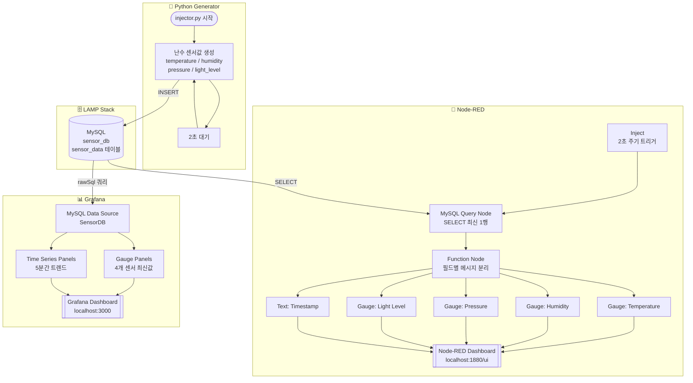
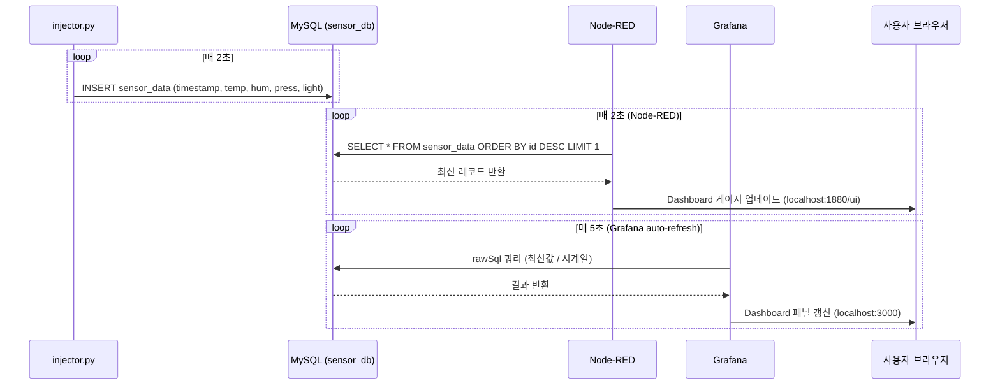

# Sensor Real-Time Monitoring System

## 프로젝트 개요

Python 스크립트(`injector.py`)가 난수 기반 센서 데이터를 생성하여 LAMP 스택의 MySQL 데이터베이스에 저장하고,
**Node-RED Dashboard**와 **Grafana Dashboard** 두 가지 경로로 실시간 모니터링하는 시스템입니다.

---

## 시스템 구성 요소

| 구성 요소 | 역할 |
|-----------|------|
| `injector.py` | 난수 센서 데이터 생성 및 MySQL 삽입 (2초 주기) |
| MySQL (LAMP) | 센서 데이터 영속 저장소 (`sensor_db`) |
| Node-RED | MySQL 폴링 → UI Dashboard 게이지/차트 표시 |
| Grafana | MySQL 데이터소스 연결 → 실시간 대시보드 |

---

## 생성 데이터 항목

| 필드 | 단위 | 범위 |
|------|------|------|
| temperature | °C | 15.0 ~ 40.0 |
| humidity | % | 20.0 ~ 90.0 |
| pressure | hPa | 980.0 ~ 1025.0 |
| light_level | lux | 0.0 ~ 1000.0 |

---

## 전체 시스템 Flowchart



---

## 데이터 흐름 상세



---

## 설치 및 실행 방법

### 1. DB 초기화

```bash
sudo mysql < setup_db.sql
```

### 2. Python 의존성 설치

```bash
pip install -r requirements.txt
```

### 3. 데이터 주입 시작

```bash
python3 injector.py
```

### 4. Node-RED 설정

```bash
# node-red 설치 (최초 1회)
sudo npm install -g node-red node-red-dashboard node-red-node-mysql

# 실행
node-red

# 브라우저에서 http://localhost:1880 접속
# 우측 상단 메뉴 → Import → node_red_flow.json 붙여넣기 → Deploy
# 대시보드: http://localhost:1880/ui
```

### 5. Grafana 설정

```bash
# Grafana 설치 (최초 1회)
sudo apt-get install -y grafana

# 프로비저닝 파일 복사
sudo cp -r grafana/provisioning/* /etc/grafana/provisioning/

# 서비스 시작
sudo systemctl start grafana-server
sudo systemctl enable grafana-server

# 브라우저: http://localhost:3000  (admin / admin)
```

---

## 파일 구조

```
project3/
├── injector.py                          # 난수 데이터 생성 및 DB 삽입
├── setup_db.sql                         # DB / 테이블 / 사용자 초기화
├── requirements.txt                     # Python 패키지 목록
├── node_red_flow.json                   # Node-RED 플로우 내보내기
├── grafana/
│   └── provisioning/
│       ├── datasources/
│       │   └── mysql.yaml               # Grafana MySQL 데이터소스
│       └── dashboards/
│           ├── dashboard.yaml           # 대시보드 프로바이더 설정
│           └── sensor_dashboard.json    # Grafana 대시보드 정의
└── project.md                           # 본 문서
```

---

## 포트 정보

| 서비스 | 포트 | URL |
|--------|------|-----|
| MySQL | 3306 | - |
| Node-RED Editor | 1880 | http://localhost:1880 |
| Node-RED Dashboard | 1880 | http://localhost:1880/ui |
| Grafana | 3000 | http://localhost:3000 |
